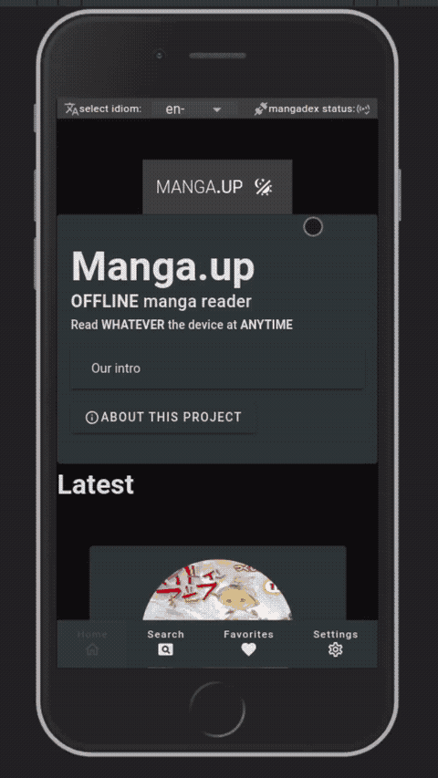
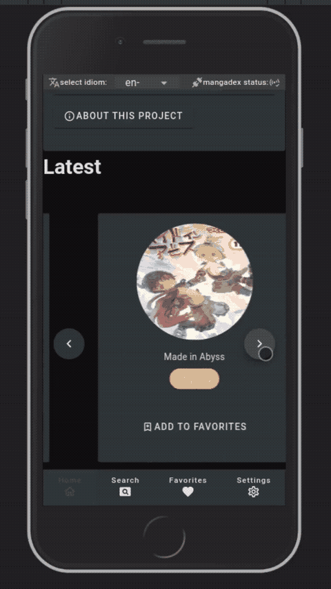
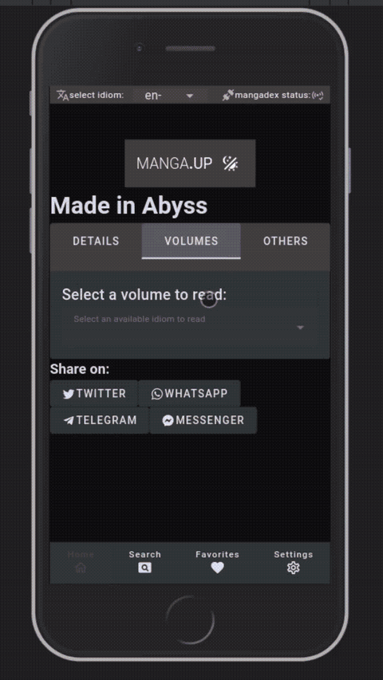
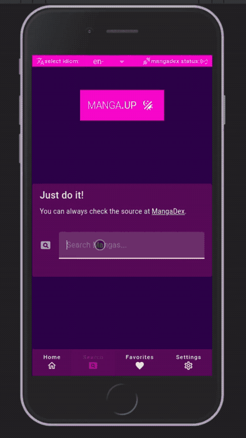
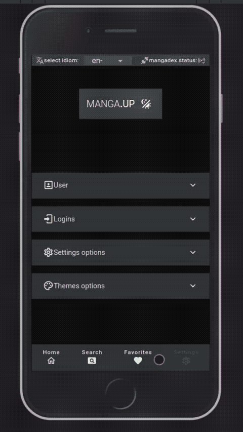

<!-- ⚠️ This README has been generated from the file(s) "docs/README.md" ⚠️--><h1 align="center">manga.up</h1>

<p align="center">
  
</p>

<p align="center">
		<a href="https://vuejs.org/"></a>
<a href="https://vuetifyjs.com/"></a>
<a href="https://www.docker.com"></a>
<a href="https://code.visualstudio.com/"></a>
<a href="https://fazendaaa.github.io/manga.up/"></a>
	</p>


<div align="center">
  <p>
  The mobile first website for a manga reader application!
  </p>
</div>

<div align="center">
  <a target="_blank" href='https://www.amazon.com/gp/product/B0BGYH6JFN'>
    
  </a>

  <a target="_blank" href="ms-windows-store://pdp/?ProductId=XPDC2RH70K22MN&mode=mini">
    
  </a>

  <a target="_blank" href='https://play.google.com/store/apps/details?id=solutions.fazenda.up.manga.twa&pcampaignid=pcampaignidMKT-Other-global-all-co-prtnr-py-PartBadge-Mar2515-1'>
    
  </a>
</div>

<div align="center">
  
</div>

- [Alternatives](#alternatives)
- [Screens](#screens)
- [Contributing](#contributing)
- [Code](#code)
  - [Project setup](#project-setup)
    - [Compiles and hot-reloads for development](#compiles-and-hot-reloads-for-development)
    - [Compiles and minifies for production](#compiles-and-minifies-for-production)
    - [Run your unit tests](#run-your-unit-tests)
    - [Run your end-to-end tests](#run-your-end-to-end-tests)
    - [Lints and fixes files](#lints-and-fixes-files)
    - [Customize configuration](#customize-configuration)
- [References](#references)
  - [Others](#others)
  - [BlogPosts](#blogposts)
  - [Inspirations](#inspirations)
  - [Tutorials](#tutorials)


[](#alternatives)

## ➤ Alternatives

- [MangaDex](https://mangadex.org/)
- [Tachiyomi](https://tachiyomi.org/)
- [Mango](https://getmango.app/#/)
- [kavitareader](https://www.kavitareader.com/)
- [Komga](https://komga.org/)
- [LANraragi](https://lrr.tvc-16.science/)
- [Tanoshi](https://faldez.github.io/tanoshi)
- [villain](https://villain.js.org/)
- [cubari](https://cubari.moe/)
- [mangahere](https://www.mangahere.cc/)
- [ComicK](https://comick.fun/)


[](#screens)

## ➤ Screens

<div align="center">
  
  
  
  
</div>

<div align="center">
  
</div>


[](#contributing)

## ➤ Contributing

Check more about this in [CONTRIBUTING.md](CONTRIBUTING.md). Here we have a list of some of our contributors:


[](#contributors)

## ➤ Contributors
	

| [](https://twitter.com/the_fznd) | [](https://github.com/andreasbm/web-config/blob/master/CONTRIBUTING.md) |
|:--------------------------------------------------:|:--------------------------------------------------:|
| [Fazendaaa](https://twitter.com/the_fznd)        | [You?](https://github.com/andreasbm/web-config/blob/master/CONTRIBUTING.md) |


[](#license)

## ➤ License
	
Licensed under [GPL-2.0](https://opensource.org/licenses/GPL-2.0).


[](#code)

## ➤ Code

This is probably the ugliest Vue 3 + Vuetify 3 in existence, but is my first time coding a front-end application; so feel free to judge, yell but have the decency to at least reference a better approach or share some code here showing how to improve it.

### Project setup

```
npm install
```

#### Compiles and hot-reloads for development

```
npm run serve
```

#### Compiles and minifies for production

```
npm run build
```

#### Run your unit tests

```
npm run test:unit
```

#### Run your end-to-end tests

```
npm run test:e2e
```

#### Lints and fixes files

```
npm run lint
```

#### Customize configuration

See [Configuration Reference](https://cli.vuejs.org/config/).


[](#references)

## ➤ References

### Others

- [PWA Icons & iOS Splash Screen Generator](https://progressier.com/pwa-icons-and-ios-splash-screen-generator)
- [Image Generator](https://www.pwabuilder.com/imageGenerator)

### BlogPosts

- [Best manga reader apps for iPhone and iPad in 2021](https://www.igeeksblog.com/best-manga-reader-apps-for-iphone-ipad/)

### Inspirations

- [Leafplayer](https://github.com/paulschwoerer/leafplayer)
- [Vue Storefront](https://github.com/vuestorefront/vue-storefront)
- [colorhunt.co/palette/](https://colorhunt.co/)

### Tutorials

- [Vuetify Tutorial](https://www.youtube.com/playlist?list=PL4cUxeGkcC9g0MQZfHwKcuB0Yswgb3gA5)
- [Vue.js User Authentication and the new Azure SDKs](https://devblogs.microsoft.com/azure-sdk/vue-js-user-authentication/): note in Azure's Overview: `Application (client) ID` == `clientId` property in `store.ts` and `authority` trailing URL ID is `Directory (tenant) ID`
- [Let’s write a Vue.js 3 Plugin with TypeScript from scratch – Part 1](https://q-now.de/2021/10/lets-write-a-vue-js-3-plugin-with-typescript-from-scratch-part-1/)
- [How To Navigate Between Views with Vue Router](https://www.digitalocean.com/community/tutorials/how-to-navigate-between-views-with-vue-router)
- [How TO - Center Elements Vertically](https://www.w3schools.com/howto/howto_css_center-vertical.asp)
- [Swiper Vue.js Components](https://swiperjs.com/vue)
- [Mock Fetch in TypeScript Jest Tests for Vue.js](https://www.damirscorner.com/blog/posts/20190517-MockFetchInTypeScriptJestTestsForVueJs.html)
- [IndexedDB API](https://developer.mozilla.org/en-US/docs/Web/API/IndexedDB_API)
- [IndexedDB](https://javascript.info/indexeddb)
- [Using promises in IndexedDB](https://dev.to/andyhaskell/using-promises-in-indexeddb-4nc0)
- [Display Breakpoints](https://vuetifyjs.com/en/features/breakpoints/#display-breakpoints)
- [How to add Social Media Sharing Links to a Vue Website](https://dev.to/lindaojo/how-to-add-social-media-sharing-links-to-a-vue-website-5d3l)
- [Suspense – new feature in Vue 3](https://vueschool.io/articles/vuejs-tutorials/suspense-new-feature-in-vue-3/)
- [Vue Charts: Line Series](https://www.ag-grid.com/vue-charts/line-series/)
- [Promoting Your Vue.js PWA Installation](https://medium.com/js-dojo/promoting-your-vue-js-pwa-installation-6bd112342c19)
- [Welcome to the Google Play badge page](https://play.google.com/intl/en_us/badges/)
- [App Store Badge](https://github.com/microsoft/app-store-badge)
- [Trademark, Brand, and Marketing Guidelines](https://developer.amazon.com/support/legal/tuabg)
- [Sample Privacy Policy Template and Examples](https://www.websitepolicies.com/blog/sample-privacy-policy-template#:~:text=Privacy%20Policy%20Examples%201%20Robinhood%20Commission-free%20trading%20platform,various%20jurisdictions.%20...%203%20Wayfair%20...%20Mais%20itens)
